> Merthsoft firmware and SLOOP Mobile for Android live on the `android` branch. Original Android work uses the Unlicense, with retained third-party obligations described in [Android licensing](android/LICENSING.md).

<b>A live groovebox firmware for the M-VAVE FM-1 — for any style.</b> 
Free and open source (GPL-3.0), based on <a href="https://github.com/hugelton/Felucca">Felucca</a> by Leo Kuroshita / Hügelton Instruments.

<a href="https://isod89.github.io/sloop-fm1/"><b>Upstream browser installer</b></a> ·
<a href="GUIDE.md">Complete guide</a> ·
<a href="SLOOP.md">Manual</a> ·
<a href="DEMARRAGE-RAPIDE-FR.md">Guide en français</a> ·
<a href="https://isod89.github.io/sloop-fm1/webapp/editor/">Web editor</a> ·
<a href="../../releases">Releases</a> ·
<a href="../../issues">Report a bug</a>

---

SLOOP turns the FM-1 into a four-track groovebox you play live: **three synths and a drum machine** with 16 sounds on the white keys, twelve synthesis engines, 153 sounds, 37 drum kits, your own samples, a song mode you play with your hands, USB audio, MIDI in on the jack and MIDI clock — and now **physical models** (guitars, sitar, bells, hand drums), a **noise** engine, **six-operator FM with DX7 patches**, **parameter locks**, **micro timing**, **fills**, a **quick chain** of sections and the **sequencer to MIDI out**. House, techno, hip-hop, trap, drum & bass, amapiano, synthwave, lo-fi, ambient, chiptune — it does not pick a style for you. Start from your own playing or optional native drum grooves and musical sequence starters.

> **Status:** beta. Please [report](../../issues) what you find. Projects, presets, samples and settings are kept during updates; see [Going back](#going-back) before downgrading.

## Contents

- [Merthsoft firmware and the one-minute workflow](#merthsoft-firmware)
- [Visualizers added in this fork](#visualizers-added-in-this-fork)
- [SLOOP Mobile for Android](#sloop-mobile-for-android)

1. [Upstream capabilities](#upstream-capabilities)
2. [Screenshots](#screenshots)
3. [Features](#features)
4. [Install](#install)
5. [Your first beat in 60 seconds](#your-first-beat-in-60-seconds)
6. [The controls](#the-controls)
7. [The menu: settings of the FM-1](#the-menu-settings-of-the-fm-1)
8. [MIDI and USB audio](#midi-and-usb-audio)
9. [The web editor](#the-web-editor)
10. [Compatibility](#compatibility)
11. [Troubleshooting](#troubleshooting)
12. [Specifications](#specifications)
13. [Documentation](#documentation)
14. [Building and tests](#building-and-tests)
15. [Contributing](#contributing)
16. [Credits and thanks](#credits-and-thanks)
17. [Licence](#licence)

---

## Merthsoft firmware

This fork keeps SLOOP's synth engines and adds ways to build and perform a complete loop quickly on the FM-1. **No phone is required for these firmware features.**

Read the [illustrated Merthsoft feature guide](docs/firmware/MERTHSOFT-FEATURES.md) for the full branch additions, physical controls and fresh firmware screenshots.

### The one-minute workflow

1. With playback stopped, select the **drum track**, open its **GROOVE** page, and choose a beat. **OCT−** auditions it without replacing your pattern; **OCT+** applies it. Hold OCT+ for 700 ms or press it twice to confirm replacing existing material.
2. Select a **synth track**, then tap **SEQ** through STEP → PATTERN → RECORD → **SEQUENCES**. Choose **POP FOUR**, your root and scale, and **ARP NOTES** for an editable I–V–vi–IV arpeggio. Listen, then apply.
3. Select another synth and apply the same starter in **BASS** mode. The browser remembers your key, scale, octave and other choices across tracks until power-off. You now have drums, harmony and bass ready to develop with your own melody, sound design and performance.

The libraries are starting points: applying creates ordinary editable sequencer steps. Your selected sounds and tempo stay intact. Preview first, and use **EDIT + OCT−** to undo a replacement.

| Sweep following ties | Move the onset into its own ties | Start a new working project |
| --- | --- | --- |
| 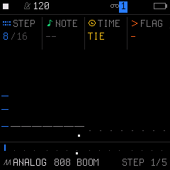 | 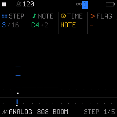 | 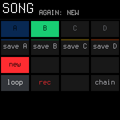 |

The [illustrated guide](docs/firmware/MERTHSOFT-FEATURES.md#record-and-correct-notes-quickly) includes before-and-after views for ties, rests and note movement, plus chord latch and song-load recovery controls.

| Native drum grooves | Musical sequence starters | Rhythm shaping |
| --- | --- | --- |
| 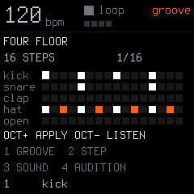 | 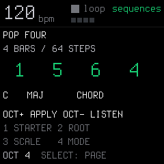 | 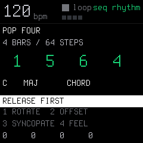 |

*Actual firmware framebuffer captures from the host UI harness.*

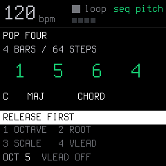

*Turn the SELECT knob twice inside SEQUENCES to reach seq pitch. Knob 1 sets octave and knob 4 VLEAD. Changing browser pages keeps audition playing.*

### What this fork adds to upstream SLOOP

These are the implemented Merthsoft additions; the upstream engine, preset and base groovebox features are described separately below.

- **Persistent scale lights:** hold physical **SEL** and press **OCT+** to toggle a dim keyboard guide matching the selected synth's SEL-page ROOT/SCALE. It replaces ordinary keyboard backlighting, so off-scale keys stay dark unless played. It follows key/scale changes, survives reboot, and leaves drum/step/FX controls clear. CHR lights every pitch class; it does not change the sound or quantize notes.
- **24 drum grooves:** four-on-the-floor, breaks, a four-bar Amen, funk, broken house, Afro clave, electro, boom bap and more. Preview using your current kit, then apply with complete pattern/metadata undo. The phone can browse and apply the canonical groove bank too.
- **24 musical starters:** standard progressions alongside soul sevenths, Dorian pockets, funk, offbeat stabs, gospel, disco, garage, Latin turns, rising/descending movement and Lydian colors. Choose **CHORD**, lower-root **BASS**, or **ARP NOTES**, which cycles chord tones at each attack (ORIGINAL adds eighth-note pulses while retaining starter syncopations). Turn **PRESET** to choose **RHY** independently: ORIGINAL or 17 named rhythms, from sparse bars to funk, offbeats and sixteenths. Rotate/offset/syncopate/feel modify that rhythm. A CHR track starts the browser in Major; its pitch page controls octave and optional voice leading independently of the physical OCT buttons.
- **Rhythm shaping:** rotate a pattern, offset drum lanes, move eligible attacks off the beat with syncopation, and add microtiming feel. Preview auditions the shaped result before replacement.
- **Fast ties and rests:** on STEP, select the starting note/chord, hold **OCT+**, and sweep **knob 1** clockwise to tie each following step. Hold **OCT−** instead to paint rests. The starting step stays intact; painting stops at the pattern's end. Backtracking moves without erasing, and the whole gesture has one undo.
- **Recording and timing correction:** RECORD-page **SNAP** records to eighths or quarters while keeping the playback DIV intact. On STEP, hold either OCT button: **knob 2** shifts whole octaves and **knob 3** moves a note/chord by whole steps with its timing, conditions and locks. Moving into its own ties keeps the original end; other moves shift the complete tie chain. Occupied destinations are protected and gestures support undo/redo.
- **Playable latch:** hold **ARP** or physical **SEL** (labelled SCL in SLOOP) for 700 ms while holding notes to toggle latch without stopping your playing. It works with chord mode and manually played arpeggios. Non-CHROM chord modifiers toggle on latched chords; CHROM allows literal black-key roots.
- **Whole-pattern pitch tools:** hold **EDIT** and turn **knob 4** to shift a synth pattern by octaves, or knob 3 for semitones. Numeric shift/transpose/octave readouts follow the last gesture and undo/redo; uniform pitch bounds preserve chord intervals.
- **Scale-aware keyboard grids and MIDI:** synth EDIT shows key-signature guides with physical-key hints (E minor: **F♯**; C minor: **E♭, A♭, B♭**) while playing/erase behavior stays unchanged. SEL shows actual mapped pitches. Set **KEYS = WHITE** to play successive scale degrees. Optional **HOME menu → SYSTEM → MIDI SCALE → KEYBOARD** applies that pitch mapping to incoming USB/TRS MIDI; default OFF keeps literal pitches. Held notes retain their original note-off mapping when settings change. See [scale/MIDI grid guide](docs/firmware/SCALE-MIDI-GRIDS.md).
- **Live vibrato and tremolo:** hold **LFO** for vibrato or **ENV** for tremolo on the selected synth only. Waveform panels show a live phase marker, pitch cents / volume percentage and a compact scale guide. They offer **free Hz / depth / waveform / beat sync** on knobs 1–4; release restores the previous screen and sound. **Hold LFO/ENV + tap HOME** to lock the panel and effect after release; HOME unlocks, and STOP/panic or track changes clear it. Knob 4 selects OFF or a division through triplets and two bars; turning knob 1 returns to free Hz. Quick taps open the normal pages, and saved patch settings stay intact. **MIDI CC1** and Android Perform's momentary strip also provide vibrato; STOP/panic clears modulation.

| Scale-aware SEL grid | Vibrato waveform | Tremolo envelope |
| --- | --- | --- |
| 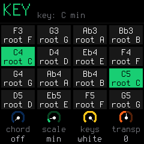 | 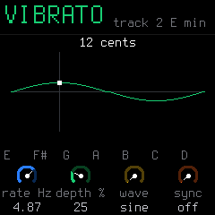 | 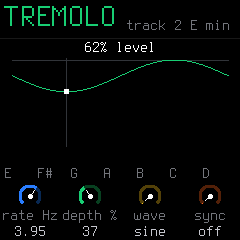 |

*Fresh renders from production firmware code in the host UI/audio harness.*

- **More chord and arp choices:** SUS2, ADD9, 6TH, SHELL, OCTAVE and explicit major/minor/seventh/diminished/augmented qualities; OUTIN, SHUF, ROOTALT, DNUP, UPDNREP, INOUT, WALK and PULSE arpeggios. See the [playing guide](docs/firmware/MERTHSOFT-FEATURES.md#play-chords-and-arpeggios) for ordering, latch and sequencer input.
- **Chord latch and literal roots:** SCL page 2 knob 4 exposes LATCH. In non-CHROM chord mode, modifier presses update the sounding latched chord immediately and remain toggled until pressed again. **KEYS/QNT CHROM** allows every piano key, including black keys, to be a literal chord root; the other keyboard modes keep their modifier controls.
- **Sequencer-fed arpeggios:** ARP 2 **ORD SNOTE/SPLAY** lets sequenced chords feed the arpeggiator, including sustained tie chains. Live and sequence input remain independent.
- **Expressive arpeggios:** incoming and sequenced velocity/accent survives arp modes, octave expansion, ties and latch across audio, MIDI output and recording. Overlapping live/sequence pitches use the stronger current velocity; PULSE merges octave collisions rather than doubling attacks. Physical keyboard attacks retain their fixed velocity.
- **Shared starter voice leading:** optional VLEAD uses the live chord inversion policy for generated CHORD/ARP NOTES sequences, anchored deterministically so Preview and Apply match. BASS stays on roots. This does not add semantic chord tracking or harmony-following tracks.
- **Black-key punch FX controls:** rate, triplet, strength, blend, latch and retrigger augment the 16 white-key effects.
- **Undo accidental song loads:** while stopped, **EDIT + OCT−** restores the project preceding the latest saved-slot load, section selection or working-project backup restore; **OCT+** redoes it. This history is held in RAM and subsequent sequence edits or recording supersede it.
- **New project from SAVE:** the SAVE-held song menu includes **NEW**, with confirmation while stopped, so starting over does not require overwriting a saved slot.
- **USB playback and return controls:** phone/app audio can play through the FM-1's speaker/headphones alongside the instrument. Negotiated gain/mute and return diagnostics are exposed to the companion; 44.1 kHz playback negotiates independently of upstream's 48 kHz capture.
- **Remote performance controls:** the phone can trigger held/next-bar fills and the sixteen punch effects. Leases, panel priority, STOP and disconnect cleanup prevent abandoned remote controls from sticking.
- **Companion protocol and safe exchange:** hardware octave reporting, FM6/native-pattern editing, sample backup/upload/readback, persistent FM6 base-voice bank saving, and canonical drum/musical library discovery support the Android workstation below. Protocol 14 retains companion command IDs and relocates upstream SYN kit commands to 80–84; the web editor negotiates the mapping. Atomic live hardware scene switching remains future work.
- **More ROM headroom:** lossless one-bit font packing removes **16,128 bytes** of bitmap data while preserving the original pixels. The splash screen is retained.
- **Six additional visualizers:** Polyrhythm, Note Trails, Groove, Stereo Field, Song Journey and Beat Terrain make track timing, pitches, stereo and arrangement visible. Fourteen styles are available; see the [complete gallery](docs/firmware/VISUALIZERS.md) for screenshots and controls.

| Locked vibrato | Locked tremolo |
| --- | --- |
| 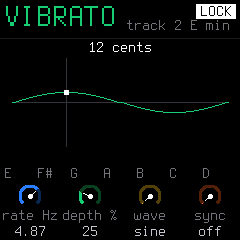 | 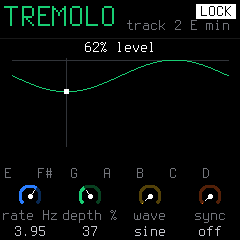 |

*Production-code framebuffer renders. Hold LFO/ENV, tap HOME, then release; HOME unlocks.*

### Visualizers added in this fork

On **TRACKS**, tap **HOME** to open the visualizer; turn **SELECT** to change style.
Tap HOME or a page button to leave. Playing, transport and held control layers still work.

| Polyrhythm | Note Trails | Groove |
| --- | --- | --- |
|  | 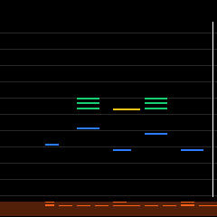 | 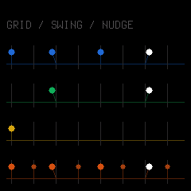 |
| Pattern lengths, active steps and independent playheads. | Chords and note releases across three synths, with drums below. | Swing, microtiming, hit levels and ratchets around the step grid. |

| Stereo Field | Song Journey | Beat Terrain |
| --- | --- | --- |
| 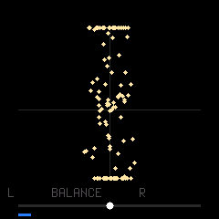 | 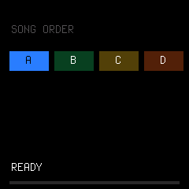 | 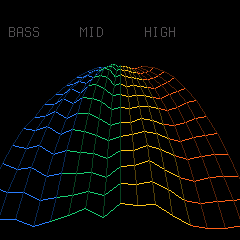 |
| Stereo spread and left/right balance. | Song or quick-chain order, current section and remaining bars; READY when idle. | Spectrum-driven hills moving with the beat. |

*Framebuffer captures from the production UI/audio harness.*
See the [complete 14-style gallery](docs/firmware/VISUALIZERS.md) for the retained upstream styles, controls and capture details.

To install **this fork**, build its firmware and local browser installer with [`build-sloop.ps1`](build-sloop.ps1); see [building](#building-and-tests) for prerequisites. The upstream browser installer linked above installs upstream SLOOP. See the [guide](GUIDE.md), [musical starters](docs/firmware/SEQUENCE-STARTERS-DESIGN.md), [drum grooves](docs/firmware/DRUM-GROOVES-DESIGN.md) and [rhythm shaping](docs/firmware/RHYTHM-SHAPING-DESIGN.md) for the controls and limits.

## SLOOP Mobile for Android

Bring the FM-1 and your phone: **SLOOP Mobile** is a C#/.NET Android companion for touch performance, sequencing, sound editing, sampling and session management over USB. Connect using a USB data cable and a phone that supports USB host mode. SLOOP mode routes performance by selected synth; **generic MIDI mode** also drives other MIDI receivers.

| Perform | FM6 sound editing |
| --- | --- |
| 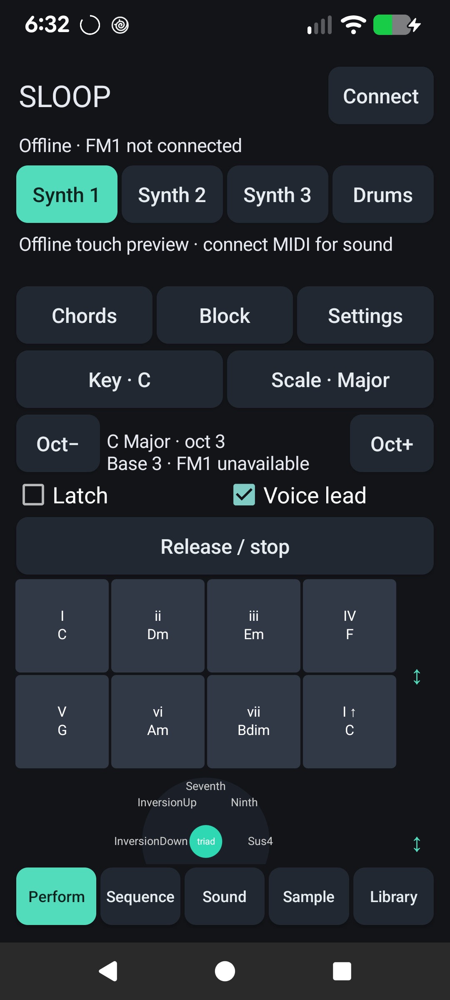 | 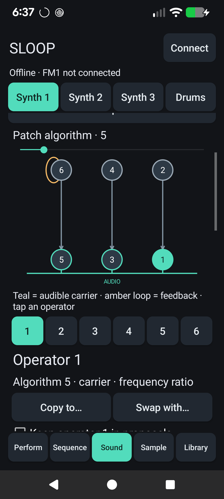 |

| Piano roll | Sampling and chopping |
| --- | --- |
| 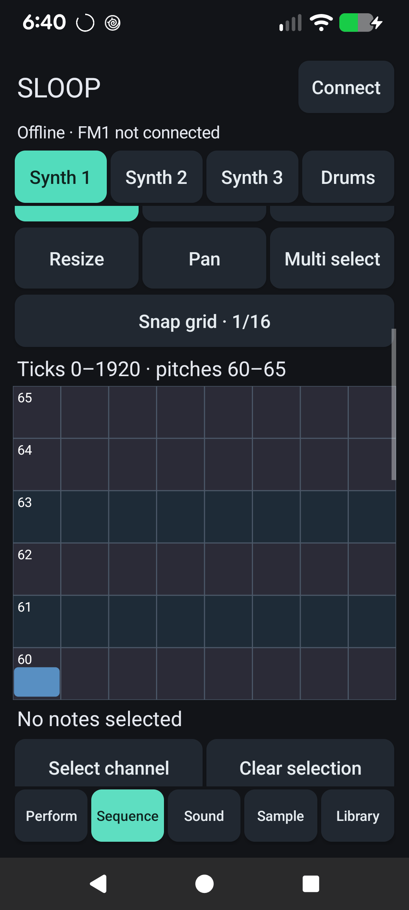 | 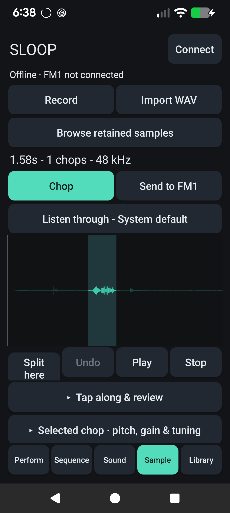 |

*Captures from the connected Pixel. The phone is connected to the PC for screenshots, so the FM-1 connection is shown offline.*

The companion also offers external MIDI device/output-port input in Perform (literal keys or bounded scale-root chords, sustain and lifecycle cleanup). FM1 arp output preserves incoming/sequenced velocities. See the [current feature status](<android/design docs/STATUS.md>) and [release evidence](<android/design docs/VERIFICATION.md>).

The app has five workspaces:

| Workspace | What you can do |
| --- | --- |
| **Perform** | Eight scale-degree chord pads including I ↑, a HiChord-style quality joystick, keyboard, scale grid, drums, ribbon and an XY MIDI CC macro. Play block chords, strums, arps or repeats; control key, scale, octave, voice leading and latch directly. Capture a performance into a loop. |
| **Sequence** | Draw, select, move, resize and quantize notes in a touch piano roll with multi-note edits and undo. Exchange native FM-1 patterns, loop MIDI, browse drum grooves and musical starters, arrange scenes and add stepped CC automation. Generate, edit, save and exchange composition drafts. |
| **Sound** | Manually edit FM6 algorithms, operators and envelopes; copy/swap operators and exchange SysEx. Try offline sound recipes and reviewed prompt edits, audition a patch against the original, and save a base voice to the hardware bank with verified readback. |
| **Sample** | Import PCM16 WAV or record from microphone/USB; trim, zoom and chop manually, equally, by transients or by tapping during playback. Review root pitch, tune and gain each chop, audition the encoded result, and send a fitted sample kit to the FM-1 with backup, readback and restore. |
| **Library** | Save named sessions, browse and reuse samples across sessions, and import/export validated session archives. Performance settings and sample processing choices travel with sessions. Composition drafts have a separate portable export/import flow. |

Prompts currently use **bounded offline procedural recipes and edit rules**. They produce notes, synth settings or reviewable edits; no audio-generation service or local language model is included. The app's MIDI performances use the connected instrument for sound, and USB sample preview can use the FM-1's audio output.

| Prompt an edit | Review the proposed change |
| --- | --- |
| 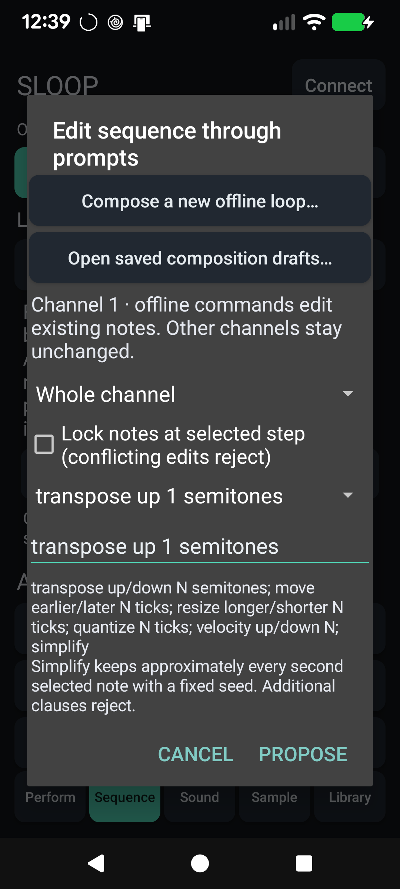 | 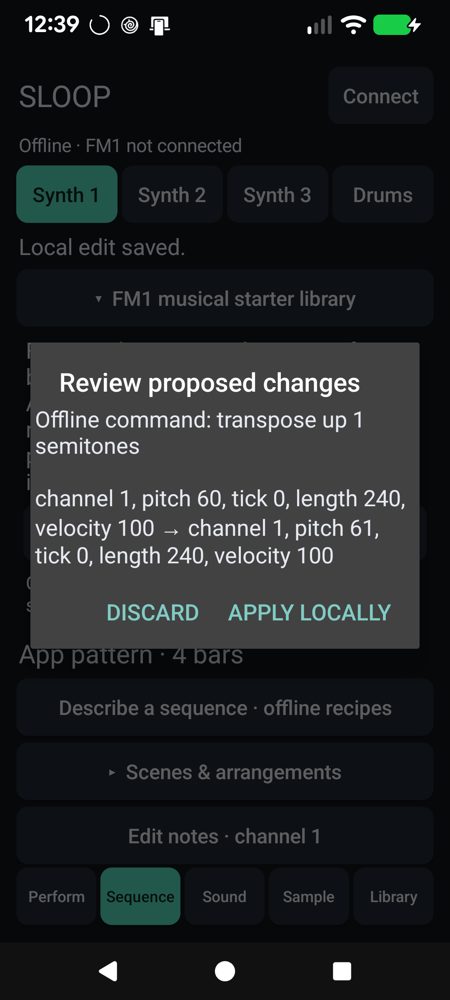 |

*Fresh connected-phone captures. This proposal was discarded after capture.*
In Sequence, **Describe a sequence · offline recipes** opens these controls.
See the [phone library and prompt walkthrough](docs/firmware/MERTHSOFT-FEATURES.md#find-libraries-and-review-prompt-edits-on-the-phone) for fresh musical-starter and groove entry screenshots too.

Android is the current target. Windows/iOS, controller CC forwarding, time stretching, combined USR3+4 uploads and atomic live hardware scene switching remain future work. See the [current status](<android/design docs/STATUS.md>) for the full implemented/future split.

Build and install from [`android/src`](android/src/README.md) using .NET 10 and the Android workload; [`Install-Phone.ps1`](android/src/Install-Phone.ps1) builds, installs and launches on an authorized USB-debugging phone. The [design index](<android/design docs/README.md>) and [verification record](<android/design docs/VERIFICATION.md>) document the architecture and checks. Original Android work uses the **Unlicense**; retained GPL/Apache components keep their obligations, including when distributing the combined app. See [Android licensing](android/LICENSING.md). Firmware remains GPL.

## Upstream capabilities

SLOOP supplies the groovebox foundation: twelve synth engines including PHYS,
NOISE and six-operator FM, 153 factory sounds, sampled and synthesised drum kits,
DX7 patch exchange, parameter locks, microtiming, fills, song chains, MIDI and USB
audio. The [features below](#features) describe the current controls; the
[manual](SLOOP.md) retains upstream history and deeper reference material.

## Screenshots

The FM-1's screen: the tracks, the REC screen and its count-in, the menu (lights and USB audio), MIDI clock, about.

Start-up, the four tracks (recording), the drum grid and the acoustic kit, the sounds by kind, the layers (punch-in FX, steps, key and chords, mix, erase), a free take, the FX sends.

The web editor: the drum track as a 16-lane grid, with levels and ratchets.

CHOP: a 20 s recording cut into 16 chops, 8 kept, fitted to the slot.

## Features

### Play it live: hold a button, touch a key

Every function button is a **layer**: hold it and the 16 white keys and the four knobs change job, and the screen shows how. Tap it and its pages open. Hold a layer button and tap HOME to **lock** it open, both hands free.

| Hold | The white keys | KNOB 1 · 2 · 3 · 4 |
| --- | --- | --- |
| **FX** — punch | 16 punch-in effects on the whole mix: loops 1/4–1/32, stutter, reverse, tape stop, half speed, filter sweeps, phone, bit crush, alias, gate, echo, tape wobble | FILTER · DUST · DUCK · the track's filter |
| **EDIT** — erase | erase a sound or a note as the loop plays (stopped: from the whole pattern) | SHIFT · LENGTH ×2 / ½ · TRANSPOSE |
| **ARP** — roll | note repeat on the grid, recorded as ratchets | RATE (1/8 … 1/64) |
| **SEQ** — steps | the 16 steps of the page; a step held: a level, a ratchet, a nudge, parameter locks (PRESETS / ALGORITHM), a fill condition (OCT+) | SOUND / NOTE · DIV · SWING · LENGTH (a step held: SOUND / NOTE · LEVEL · RATCHET · NUDGE) |
| **SEL** — key | the key of the song | CHORD · SCALE · KEYS · TRANSPOSE |
| **GLO** — mix | 1–4 mute, 5–8 solo, 9 fill (held), 10 fill on the next bar, 16 tap tempo | the levels of tracks 1–4 |
| **SAVE** — song | 1–4 play sections A–D (several tapped while held: a quick chain), 5–8 save the loop into them, 13 loop / song, 14 record the song, 16 the chain | — |

Keys 1, 5, 9 and 13 glow dimly while a layer is held: the first key of each row of the 4 × 4 grid on the screen. **EDIT + OCT− / OCT+** is undo / redo.

### Drums

- **16 sounds on the white keys**, kick to cowbell; a black key doubles the white key on its left (fast rolls with two fingers).
- **Ghost and hard hits:** hold OCT− / OCT+ while you play. Every hit keeps its level (GHOST, SOFT, NORM, HARD) and a **ratchet** (x1–x4).
- **37 kits**, all level-matched: a sampled acoustic kit in 5 treatments (CC0 studio recordings) and 32 synthesised kits — 808, 909, 606, 80s, vintage, trap, drill, boom bap, lo-fi, phonk, house, deep house, techno, minimal, electro, disco, UK garage, jungle, dubstep, reggaeton, amapiano, afrobeat, latin, tribal, synthwave, chiptune, arcade, glitch, industrial, hyperpop, ambient, jazz brushes. Each synthesised sound is built like on the classic machines; softer hits are darker as well as quieter. **Your own kits** too: KIT USR1–USR4 (or USR3+4, about 15 s) plays sample slots you fill in the editor's Drum kit page, a sound of yours per lane. And **SYN1–SYN4**, synthesised kits you make in the editor's Drum synth page.
- **Grid and kit pages** on the FM-1 (EDIT or SEQ on the drum track): on the grid, the keys are the steps of the sound you pick (and you hear it); a 16-lane grid in the web editor.

### Synths and sounds

- **Twelve engines:** analog, 4-op FM, **6-op FM with DX7 patches (FM6)**, phase distortion, three-oscillator, tonewheel organ, formant voice, granular, lo-fi chip, sampler, **physical models (PHYS)**, **noise (NOISE)**.
- **153 sounds, browsed by kind** — basses (sliding 808s, acid 303, reese, FM, bass guitar), guitars, sitar and koto (physical models), keys (Rhodes, a real Steinway grand, house and afro keys), organs and accordion, pads (string machine, granular clouds), leads (supersaw, talkbox, pan flute, harmonica), plucks and bells (harp, steel drum, glockenspiel, celesta, xylophone), stabs and dub chords — every one level-matched. **32 slots** for your own presets.
- Envelopes (with a pitch punch for 808s), LFO, arpeggiator, glide and voice modes (POLY, MONO, LEGATO, UNISON), per-track drive and slicer, sends to a **stereo chorus**, a **tempo delay** (dotted 1/8 and 1/16 too) and a **stereo reverb**.
- **Key and chords (SEL):** the key of the song for all synths, 16 scales, one-key chords (triad, 7th, 9th, sus4, power), keys snapped to the scale or the scale on the white keys.

### Recording and the sequencer

- **Records as you play, no click needed:** while it plays, REC records at once and every pass is added on top (overdub). Notes land where you heard them: the ~12 ms of the keys are taken back.
- **The REC screen:** **mode** *free* — no tempo, no grid: play, press REC on the "1" after your last bar, and the loop's length sets the tempo — or *tempo* — record at the tempo you set; **length** 1, 2 or 4 bars; **start** on your first note, or after a one-bar **count-in**.
- **Hold REC ~2 s** to clear a track; **undo / redo** brings it back.
- **64 steps per track**, each track with its own length and division, 1/32 to two bars (polymeters stay in phase); chords up to 4 notes a step, ties, slide; **MPC swing**, 0 (straight) to 100; one sample-accurate clock for everything: no drift at any tempo.
- **Parameter locks, micro timing and fills:** hold a step to give it its own value of any sound parameter, to nudge it off the grid, or to make it play only (or never) during a fill.
- The PLAY light flashes on every beat (a visual metronome); an audible click is in GLO → GLOBAL → CLICK and is never recorded.

### Songs

Save up to four sections **A–D** (SAVE + keys 5–8), play them live on the next bar (SAVE + keys 1–4), and **record the song as you play it** (SAVE + key 14). Keep SAVE held and tap several sections for a **quick chain**. In song mode PLAY plays the whole chain. The SONG screen edits it by hand.

### Effects and master

- **16 punch-in effects** (FX + a key), locked to the tempo.
- **Master:** **DUST** (an old sampler and a record: bits, rate, crackle), **DUCK** (the kick pumps the synths), **FILT** (a DJ filter: low-pass ← off → high-pass), and an output limiter.

### Your own samples

- **Four slots** (USR1–USR4) of about 7.4 s each, played by a synth track or as a drum kit (USR3+4: one kit of about 15 s); up to 16 WAV files per slot, each on its own key.
- **CHOP** in the web editor: open or drop a recording (WAV, MP3, AIFF…) of **any length**, tap along while it plays (each tap snaps to its hit), or find the hits, a tempo grid, equal parts; keep the chops you want, shorten them or **Fit to slot**; send them to a slot, one per key, or download them as WAV files.

### MIDI

- **USB MIDI** in and out, class compliant.
- **TRS MIDI IN** (the 3.5 mm jack) for a keyboard or a pad controller.
- **MIDI clock in** (USB or TRS): tempo, START, CONTINUE, STOP.
- **MIDI CCs**: level, pan, filter, resonance, envelope, glide and the sends from a controller's knobs.
- **MIDI out:** the keys always; the sequencer, the arp and the rolls too with GLO → SYSTEM → MIDI = SEQ.
- Details: [MIDI and USB audio](#midi-and-usb-audio).

### USB audio

The FM-1 is also a **USB audio input**: record its master output on a computer, no driver, over the same cable as MIDI and the editor. Details: [USB audio](#usb-audio-record-the-fm-1-on-a-computer).

### Lights for playing in the dark

Every button can glow so its label is readable on a black FM-1; the C keys or every white key can glow too; the notes playing can light their keys. Details: [The menu](#the-menu-settings-of-the-fm-1).

### Memory and safety

- **Autosave:** stop and leave it 2.5 s, your work is kept; at power-on SLOOP comes back exactly as you left it.
- **4 projects**, **32 user presets**, **27 FM6 patches**, **undo / redo**.
- **Full backup and restore** from the web editor.
- **Safe updates:** the installer checks the package (SHA-256) before writing it, the update loader checks it again (CRC) before starting it; an interrupted install finishes when you press Install again; **USB rescue** (OCT− at power-on).

## Install

### From the browser (recommended)

1. Open **[the SLOOP installer](https://isod89.github.io/sloop-fm1/)** in **Chrome or Edge** on a computer.
2. Connect the FM-1 by USB — a **data** cable, directly (no hub).
3. Press **INSTALL**, allow MIDI access, and wait for *Done*. The FM-1 restarts on the SLOOP logo.

Nothing to download or compile. Your projects, user presets, samples and settings are kept. After an install, **unplug and plug the FM-1 back in** once so the computer finds its USB audio input.

### Other ways

- **Python:** the `.fwsc` of a [release](../../releases) with `python tools/fm1_install.py sloop.fwsc` (needs `pip install mido python-rtmidi`).
- **Build it yourself:** see [Building and tests](#building-and-tests); on Windows, `INSTALL-SLOOP.bat` builds SLOOP and opens the installer locally.

### Going back

- **To an earlier SLOOP:** install its `.fwsc` from [releases](../../releases). Samples, user presets and settings stay, but older firmware may not understand newer project formats, engines or kits. An incompatible project can appear empty and be overwritten by autosave. **Save a backup before going back**, check format compatibility in the [manual](SLOOP.md), and restore only with firmware that supports that backup.
- **To the official firmware:** on the installer page, open **Return to the official firmware (V15)**. Save a backup with the editor first, download FM-1 V15 from m-vave.com and select its `FM-1.fwsc` — only that exact file is accepted. M-VAVE's updater, M-UPGRADE, works too. To come back, install SLOOP again and restore your backup.

### Rescue

- **The FM-1 no longer starts SLOOP:** hold **OCT−** alone while switching it on (*SLOOP USB RESCUE*), then install again.
- **An install was cut off:** the FM-1 stays in update mode; press INSTALL again and it finishes.
- If an FM-1 no longer starts at all, recovery needs [FM-1-transporter](https://github.com/kurogedelic/FM-1-transporter).

> Custom firmware is installed at your own risk. No warranty.

## Your first beat in 60 seconds

1. **ALGORITHM** to track **4** (orange, drums). The white keys are 16 drum sounds; **PRESETS** picks a kit (try *808* or *BOOMBAP*).
2. Press **REC** and play a beat freely, at your own tempo. Hold **OCT−** while you hit for ghost notes, **OCT+** for hard ones.
3. **Press REC on the "1" after your last bar.** The loop closes, its length sets the tempo, the hits snap to the grid and it plays at once. (Prefer a set tempo, or a count-in? Turn KNOB 1 and KNOB 3 on the REC screen before you start.)
4. **REC** again while it plays: you record on top. Hold **ARP** and hold the hat key for a hat roll.
5. **ALGORITHM** to track **1**, **REC**, play a bass line. Hold **SEL** and press the key of your song; on track 2, hold SEL and turn **KNOB 1** to *7TH*: every white key now plays a chord.
6. Hold **FX** and press a white key for a punch-in effect; still holding FX, turn **KNOB 2** for DUST, **KNOB 3** for DUCK.
7. A mistake? Hold **EDIT** and press **OCT−**: undo.

## The controls

| Control | What it does |
| --- | --- |
| **MASTER** | volume (and the USB audio level, if USB AUDIO is on MASTER) |
| **SELECT** | on HOME and inside a layer: tempo · on a page: the previous / next page of its group · DRUMS: grid / kit |
| **ALGORITHM** | the selected track: 1 · 2 · 3 (synths) · 4 (drums) |
| **PRESETS** | the selected track's sound, or the drum kit |
| **KNOB 1–4** | what the four dials at the bottom of the screen show, each in its colour |
| **OCT− / OCT+** | octave (both: back to 0) · on the drum track, held: ghost / hard hits |
| **FX · SEL · ENV · LFO · EDIT · GLO** (top row) | tap: their pages · hold FX, SEL, EDIT, GLO: a layer; hold LFO / ENV: temporary vibrato / tremolo. **SEL** is the second button of the top row, between FX and ENV (not the SELECT knob) |
| **HOME** | the TRACKS screen · on it: the full-screen visualiser (SELECT: 14 styles; HOME again closes it) · hold: the menu · tapped while a layer is held: lock it |
| **SAVE** | on TRACKS: the SONG screen · elsewhere: the SAVE pages · hold: the song layer |
| **ARP · SEQ** | tap: their pages · hold: note repeat · steps |
| **PLAY** | start / stop all four tracks; its light flashes on every beat |
| **REC** | playing: record now / stop · stopped: arm (the REC screen) · hold: clear the track |
| **EDIT + OCT− / OCT+** | undo / redo |

Colours: **blue** track 1 and KNOB 1, **green** 2, **yellow** 3, **orange** 4 (drums). White is what you touch; red is recording.

## The menu: settings of the FM-1

Hold **HOME**. The menu is in four sections, as the pages are: **SCREEN** (COLOR, ZOOM), **LIGHTS** (LIGHTS, KEYS, NOTES), **AUDIO** (LOWCUT, USB AUDIO, USB SERIAL), **SYSTEM** (HARDWARE CALIBRATION, ABOUT). **SELECT** goes from one section to the next, **KNOB 1, 2, 3** set the section's rows (each row shows its knob's colour), **PRESETS** moves the cursor, **OCT+** steps the cursor's setting round or opens it (CALIBRATION, ABOUT), **OCT−** closes. These are settings of the FM-1, not of a project: loading a project or NEW PROJECT does not change them, and the backup keeps them.

| Item | Choices | What it does |
| --- | --- | --- |
| **COLOR** (SCREEN) | 5 palettes | the screen's colours |
| **ZOOM** (SCREEN) | OFF / ON | a large readout of the value you turn |
| **LIGHTS** (LIGHTS) | OFF / LOW / MID / HIGH | every button glows at that level; what is active stays at full light |
| **KEYS** | OFF / C KEYS / WHITE KEYS / ALL KEYS | the C keys, every white key, or every key glow too |
| **NOTES** | OFF / ON | the notes playing on the selected synth track light their keys (sequencer notes too, at least a tenth of a second each), on every page and in every layer |
| **SPEAKER LOWCUT** (AUDIO) | OFF / ON | a low cut for the small built-in speaker |
| **USB AUDIO** | MASTER / FULL | the level of the USB audio input: follows the MASTER knob, or a fixed full level |
| **USB SERIAL** | OFF / ON | a serial console for developers; OFF (default) so macOS 13–15 show the USB audio input; at the next start |
| **HARDWARE CALIBRATION** (SYSTEM) | | the panel table, if a key or a knob answers wrongly |
| **ABOUT** | | installed firmware identification and credits |

Two more settings of the FM-1 live elsewhere: **SYNC** (GLO → SYSTEM: INT, USB or TRS) and the REC screen's **mode** and **start**.

## MIDI and USB audio

### MIDI in

SLOOP takes MIDI from two places at once:

- **The MIDI IN jack** (3.5 mm TRS): a keyboard or a pad controller with a MIDI output, through a **TRS-to-DIN MIDI adapter**. If nothing plays, try the other adapter type (A / B).
- **USB**, from a computer or a phone (a DAW, a MIDI routing app) or a USB MIDI host box.

| MIDI channel | Plays |
| --- | --- |
| 1, 2, 3 | synth tracks 1, 2, 3 |
| 10 | the drum track (the nearest of its 16 sounds; GLO → DRUMS → CH changes the channel) |
| 4–16 | the selected track: set your keyboard to channel 4 and it follows ALGORITHM |

A USB keyboard plugged **straight into the FM-1** cannot work: both are USB devices, and a USB link needs a host (a computer, a phone, or a USB MIDI host box). Bluetooth MIDI is not supported: SLOOP, like Felucca, never switches the radio on.

### MIDI out

What you play on the keys always goes out on USB MIDI, each track on its channel (1–3 the synths, 10 the drums). GLO → SYSTEM → **MIDI** = **SEQ** sends what the sequencer, the arp and the rolls play too: every note is ended, STOP ends whatever was still on, and notes that came in from a computer or the jack are never sent back. Record the FM-1's MIDI in a DAW and you get your pattern as notes.

### MIDI clock in

GLO → SYSTEM → **SYNC** = **USB** or **TRS** (INT: SLOOP's own tempo). START plays from the top, CONTINUE carries on, STOP stops; the tempo follows the master and the steps follow its 24 pulses a beat, so SLOOP never drifts. When the clock stops for half a second, PLAY on the FM-1 plays at its own tempo again.

**Clock only:** GLO → SYSTEM → **IN** = **CLOCK**: SLOOP follows the clock and ignores incoming notes (and CCs), handy when a DAW or a sequencer also sends notes to other gear.

### MIDI CCs

The knobs of a MIDI controller set the sound, on the track the channel plays (as the notes: 1–3 the synths, 10 the drums, 4–16 the selected track). A CC sets its parameter as a knob would, 0–127 over its range. The standard map of Felucca 1.1.5:

| CC | Sets |
| --- | --- |
| 5 | GLIDE |
| 7 | LEVEL (on the drum channel: GLO → DRUMS → LVL) |
| 10 | PAN |
| 71 | the engine's resonance (RES or Q: ANALOG, TRIO, VOICE, NOISE; the others ignore it) |
| 72 · 73 · 75 | release · attack · decay |
| 74 | the track's FILTER: 64 off, lower a low-pass, higher a high-pass (every engine, the drums too) |
| 91 · 93 · 94 | the reverb, chorus and delay sends (on the drum channel 91 and 94 are GLO → DRUMS → REV and DLY) |

This fork also supports **CC1 modulation** as transient vibrato, separate from saved patch depth, and CC120/121/123 clear modulation. Other unmapped CCs, including sustain, are ignored by the firmware.

### USB audio: record the FM-1 on a computer

On USB the FM-1 is also an **audio input named "Felucca"**: 44.1 or 48 kHz (including phones and apps that only take 48 kHz), 16-bit stereo, class compliant — no driver on Windows, macOS or Linux. Choose it in your DAW or in Audacity and record: you get the master output, exactly what the headphones play (after DUST, DUCK and FILT). MIDI, the web editor and the installer keep working on the same cable.

- **The level:** HOME menu → **USB AUDIO**. **MASTER** (default): the recording follows the MASTER knob, as the headphones do — keep MASTER well up while you record. **FULL**: a fixed level, as with MASTER all the way up, kept from clipping by the limiter; MASTER then only sets the headphones (the right choice for an interface with no level control).
- **The first time** (and after an install), the computer sets the FM-1 up again as a MIDI + audio device: unplug and plug it back in if the input does not show. The MIDI port keeps its name.
- The audio input comes from Felucca 1.0.

## The web editor

Open it from the [installer page](https://isod89.github.io/sloop-fm1/) (or the [editor link](https://isod89.github.io/sloop-fm1/webapp/editor/)) in Chrome or Edge, with the FM-1 on USB, and press **Connect**. It follows the device live: turn a knob on the FM-1 and the editor moves.

- **Sound** — every parameter of the selected track, the engines and the presets; on an FM6 track the **FM6** panel: every operator, the bank, **Import / Export SysEx** (DX7 voices and banks).
- **Sequencer** — the steps, as tiles or as a **piano roll**, and the track's length (1–64 steps); on the drum track a grid of 16 sounds × the steps, with levels and ratchets, and the kit. Click a step for its nudge, parameter locks and fill condition. **Export MIDI / Import MIDI**: the selected track as a MIDI file, and back.
- **Tracks** — the four channel strips.
- **Song** — the order of the sections A–D (the SONG screen): which section, how many bars, how many times, and whether the song starts again at the end.
- **Library** — your user presets and preset files.
- **Samples** — the three user slots, files and **CHOP**.
- **Drum synth** — your own synthesised kits SYN1–SYN4: every value of every drum sound, heard at once.
- **Projects** — the four projects, and **Backup**: *Save a backup* writes everything on the FM-1 to one file (with the FM6 bank); *Restore from a file* puts it all back (stop playback first).
- **Settings** — global, master (DUST, DUCK, FILT, ROLL), drums.

The protocol is documented in [web/EDITOR_PROTOCOL.md](web/EDITOR_PROTOCOL.md).

## Compatibility

| | |
| --- | --- |
| Device | M-VAVE FM-1 (the official firmware can be put back at any time) |
| Installer and editor | **Chrome or Edge** on Windows, macOS or Linux (they use Web MIDI with SysEx) |
| Cable | a USB **data** cable, plugged directly (no hub) |
| USB audio | any computer that takes a class-compliant USB audio input (no driver) |
| MIDI IN jack | 3.5 mm TRS, through a TRS-to-DIN MIDI adapter (type A or B) |
| Not supported | Bluetooth MIDI; a USB keyboard plugged straight into the FM-1 |

## Troubleshooting

**The installer or the editor does not find the FM-1.** Use Chrome or Edge, a data cable, no hub, and allow MIDI access. Close every other app or tab that uses MIDI (a DAW, M-UPGRADE, another editor tab), then reload the page.

**An install stopped half-way.** The FM-1 waits in update mode: press INSTALL again. If SLOOP no longer starts, hold **OCT−** alone while switching on (*SLOOP USB RESCUE*) and install again.

**The black keys make no sound on a synth track.** That track plays chords or the scale on the white keys (in chord mode the black keys change the chord: CHORD+): hold **SEL** (between FX and ENV) and set **KNOB 1 CHORD** to OFF and **KNOB 3 KEYS** to OFF. The drum track always uses the black keys.

**Nothing plays from the MIDI IN jack.** Try the other adapter type (A / B); check the keyboard's channel (1–3 synths, 10 drums, 4–16 the selected track).

**The USB audio input does not show.** Unplug the FM-1 and plug it back in (after an install the computer must find it again). On a Mac (macOS 13–15), check that HOME menu → **USB SERIAL** is OFF (the default), then restart the FM-1. In Audacity: Transport → Rescan Audio Devices. On Windows: Sound settings → Recording → show disabled devices.

**The USB recording is too quiet, or follows the volume knob.** Set HOME menu → **USB AUDIO** to **FULL**, or turn MASTER up.

**Recorded notes move to the grid.** SLOOP quantises what you record to the steps of the track (its **DIV**: 1/4 … 1/32, triplets). For finer timing, set DIV to 1/32, or hold the step and nudge it (KNOB 4); for groove, use SWING.

**Notes fade out on a dense part.** The processor is at its limit: SLOOP fades one voice at a time (never the bass or the lead) rather than glitching. Fewer held notes or a lighter engine help.

**An FM6 sound changed after loading a project.** A project keeps the track's patch slot (PTCH), not the patch itself: store a patch you edited in the bank (editor → FM6 → Store in bank) and set PTCH to it.

**The lights or SYNC went back to OFF / INT.** You went back to an earlier SLOOP, which does not keep them; set them again after reinstalling compatible firmware.

Something else? [Open an issue](../../issues): what you did, what you expected, what happened, and the version shown in HOME menu → ABOUT.

## Specifications

| | |
| --- | --- |
| Tracks | 3 synth parts (8 voices shared) + drums (16 sounds, 6 voices) |
| Sounds | 153 presets on 12 engines (browsed by kind, level-matched), 6-op FM with DX7 SysEx import and a 27-patch bank, 8 sampled sets (CC0), 4 slots for your own samples (USR1–USR4), 32 user presets |
| Drum kits | 37 (5 sampled, 32 synthesised, 16 sounds each), level-matched, plus your own: USR1–USR4 and USR3+4 (about 15 s) |
| Sequencer | 64 steps per track, own length and division each (1/32 to two bars); chords with a level and ratchet per note; drums with a level and ratchet per sound; ties, slide; per-step parameter locks (24 per track), micro timing (±½ step in 1/64) and fill conditions; swing 0 (straight) to 100 (MPC 75 %); one sample-accurate clock (no drift) |
| Recording | live, quantised as heard (latency-compensated), overdub; free take (the tempo follows you) or the tempo set; start on the first note or a one-bar count-in; 1, 2 or 4 bars |
| Performance | layers: punch-in FX, erase, note repeat, step entry, key / chords, mute / solo / fill / tap tempo, song sections and a quick chain of up to 8 |
| Effects | 16 punch-in effects; master DUST, DUCK, DJ filter, limiter; per track drive, slicer, sends to a stereo chorus, a tempo delay (dotted 1/8 and 1/16 too) and a stereo reverb |
| Memory | autosave, undo / redo, 4 projects, 32 user presets, 27 FM6 patches, song of 4 sections × 16 steps × 1–64 bars, full backup / restore (editor) |
| Audio | 44.1 kHz, fixed-point DSP; USB audio input (the master output, 16-bit stereo at 44.1 or 48 kHz, class compliant) |
| MIDI | USB class-compliant in / out (the keys, or the sequencer too); TRS MIDI IN (3.5 mm); MIDI clock in (USB or TRS), clock only if you like (IN = CLOCK) |
| Lights | button backlight (3 levels), C keys / white keys, played notes |
| Update | over USB from the browser (SHA-256 and CRC checked), USB rescue, return to the official V15 |

## Documentation

- [GUIDE.md](GUIDE.md) — **the complete guide**: every button, combination, layer, page, engine and editor page, with a one-page cheat sheet
- [SLOOP.md](SLOOP.md) — the manual (every page, layer, sound and kit) and the history of each version
- [DEMARRAGE-RAPIDE-FR.md](DEMARRAGE-RAPIDE-FR.md) — guide de démarrage en français
- [BUILDING.md](BUILDING.md) — building, build options and tests
- [web/EDITOR_PROTOCOL.md](web/EDITOR_PROTOCOL.md) — the editor's SysEx protocol
- [LICENSING.md](LICENSING.md) — the licences of the code and the assets

## Building and tests

See [BUILDING.md](BUILDING.md). In short: the JieLi toolchain and three files of the AC79 SDK, then `./build.sh` (Linux / macOS) or `INSTALL-SLOOP.bat` (Windows with WSL), which builds the firmware and serves the installer and the editor on `http://localhost:8766`.

`tests/run_tests.sh` runs the host test suite with no hardware: audio renders against golden hashes, CPU budgets, the sequencer's timing (no drift, swing, ratchets, rolls, the REC modes and the count-in, MIDI clock), the UI pages and layers, the knobs, flash storage, the update loader, MIDI and USB audio, and the web pages (editor, backup, CHOP, installer).

## Contributing

- **Bugs and ideas:** [open an issue](../../issues) — what you did, what you expected, what happened, and the version in HOME menu → ABOUT.
- **Pull requests** are welcome. Keep the style of the code around your change, add a host test when you can, and make sure `tests/run_tests.sh` passes. Contributions are credited in the release notes and the manual.
- By contributing you agree that your code is released under GPL-3.0, like the rest of SLOOP.

## Credits and thanks

- **[Felucca](https://github.com/hugelton/Felucca)** by **Leo Kuroshita** (@kurogedelic) / **Hügelton Instruments** — the engines, the sequencer, the editor, the installer, the USB audio input, MIDI clock, knob reading and many fixes, and the FM6 engine and its DX7 patch editor. Thank you.
- **@renebohne** — the played-note key lights (pull request #11).
- **ChanceTheMaker** and **keremimo** — the TRS MIDI input fix (Felucca Salt) and contributions to the MIDI clock.
- **Everyone who installed SLOOP, made music with it, commented, reported a bug or asked for a feature** — many features come from your messages (parameter locks, DX7 patches, dotted delays, longer steps: you asked for them).
- Samples: Versilian Studios VSCO-2 CE and VCSL, Sonic Pi (all CC0). Font: Terminus (SIL OFL 1.1). Icons: Fukiai (MIT, Hügelton Instruments). PHASE engine after CrispyZebra (GPL); VOICE after klattsch (MIT); FM6: msfa from Dexed by Google Inc. and Pascal Gauthier (Apache-2.0).
- Interface ideas after teenage engineering's pocket operators and EP-133, Elektron's step entry and Akai's MPC (swing, note repeat, erase).

## Licence

Code: GPL-3.0-only (see [LICENSE](LICENSE), and [LICENSING.md](LICENSING.md) for the assets). No warranty. M-VAVE and FM-1 are trademarks of their owners; SLOOP is not affiliated with M-VAVE, teenage engineering, Elektron or Akai. Drum kit names describe styles, not products.
