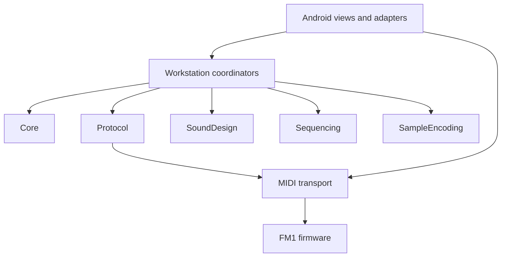

# SLOOP Mobile documentation

Start with [STATUS.md](STATUS.md) for what is implemented and what remains, then
[DESIGN.md](DESIGN.md) for the product and platform architecture. Hardware testing is
accepted by the user for now. [VERIFICATION.md](VERIFICATION.md) records the latest
combined checks and installation; [RELEASE-NOTES.md](RELEASE-NOTES.md) records the latest firmware.

Component documents describe current behavior and explicitly identified future contracts.
Completed chat assignments, handoffs, older checks and releases are in [archive](archive/README.md).

| Area | Documents |
| --- | --- |
| Architecture | [Core](CORE.md), [Android](ANDROID.md), [UI](UI.md), [Storage](STORAGE.md) |
| Device and audio | [Protocol](PROTOCOL.md), [Firmware](FIRMWARE.md), [Audio](AUDIO.md), [USB playback](USB-PLAYBACK.md), [Generic MIDI](GENERIC-MIDI.md) |
| Workstation | [Sampling](SAMPLING.md), [Performance](PERFORMANCE.md), [Sequencing](SEQUENCING.md), [Scenes](SCENES.md) |
| Sound | [Sound workflow](SOUND.md), [Manual FM6](FM6-EDITOR.md), [Prompt sound design](AI-SOUND.md) |
| Prompting and development | [Composition](COMPOSITION.md), [Prompt editing](PROMPT-EDITING.md), [Simulation](SIMULATION.md) |

Firmware feature designs live in the [firmware documentation index](../../docs/firmware/README.md),
including starter libraries, recording/STEP editing and shared harmony foundations.

## Documentation conventions

- STATUS owns the implemented-feature list and remaining backlog; avoid duplicating delivery tables.
- Component docs own behavior, public contracts and limitations. Update them when behavior changes.
- VERIFICATION owns dated build/test/device evidence; user acceptance and measured results are distinct.
- RELEASE-NOTES owns the current package identity and metrics. Archive superseded release notes.
- Handoffs are temporary coordination notes. Incorporate unresolved requirements into the owning
  component document before archiving a completed handoff.

## Dependency direction

Shared domain libraries build without Android; the solution includes the integrated app
and independently runnable domain checks. Atomic live hardware scenes remain unfinished;
the production firmware uses the existing stopped-only transfer path.
