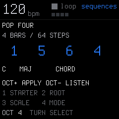
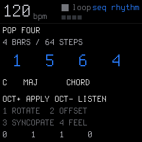
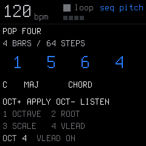
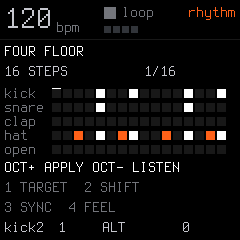
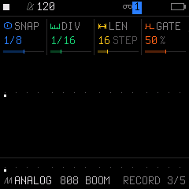
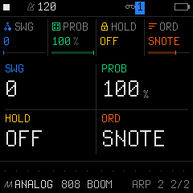
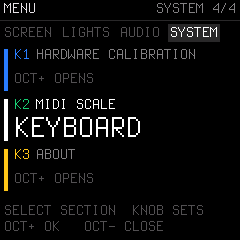
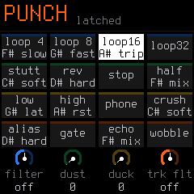

# Playing the Merthsoft firmware

This guide covers the additions to upstream SLOOP 2.5 in the `android` branch,
through **2.5 Merthsoft.14**. Everything in the native workflow below works without
a phone. The [complete player guide](../../GUIDE.md) also covers upstream features;
the [Android overview](../../README.md#sloop-mobile-for-android) covers the companion.

**SEL** is the physical button between FX and ENV, historically labelled SCL in
firmware. **SELECT** is the separate rotary encoder. They do different things.

## Build a loop in a minute

1. Select drums. Tap EDIT or SEQ to reach **GROOVE**, choose a beat, and press
   **OCT−** to listen through the current kit. Press OCT− again to stop preview.
2. Press **OCT+** to apply. Replacing existing material requires another press or
   a continuous **700 ms hold**. Playback and recording must be stopped.
3. Select a synth. Tap SEQ through **STEP → PATTERN → RECORD → SEQUENCES**.
   Select POP FOUR, your key and scale, and **ARP NOTES**. Listen, then apply.
4. On another synth, apply the same progression in **BASS** mode. Add a melody,
   choose sounds and develop the ordinary editable steps you have just created.

| Drum grooves | Musical starters |
| --- | --- |
|  |  |

There are **24 grooves**, including funk, broken house, electro, Afro clave,
boom bap and a four-bar Amen break, and **24 musical starters**, including standard
progressions, soul sevenths, gospel turns, disco, garage, Latin and unusual pockets.
The libraries preserve your kit/preset, tempo and other tracks. Applied material
replaces the selected track's pattern and timing metadata; **EDIT + OCT−** undoes
the complete replacement and **EDIT + OCT+** redoes it while stopped.

## Shape the rhythm and register

Turn **SELECT** inside SEQUENCES to visit its main, rhythm and pitch pages.
Page changes preserve the audition; changing a configuration knob stops it.
The physical SEL button opens chord settings instead. Tapping SEQ leaves the
browser for SONG; that final screen belongs to the sequence family.

| Sequence rhythm | Sequence pitch | Drum SHAPE |
| --- | --- | --- |
|  |  |  |

| Page | Knob 1 | Knob 2 | Knob 3 | Knob 4 |
| --- | --- | --- | --- | --- |
| SEQUENCES main | Starter | Root | Scale | CHORD / BASS / ARP NOTES |
| Sequence rhythm | Rotate | Offset | Syncopation | Feel |
| Sequence pitch | Octave | Root | Scale | VLEAD |
| Drum SHAPE | Target lane/all | Shift | Syncopation | Feel |

Positive shifts move later, wrapping within the pattern. Syncopation moves eligible
on-beat attacks into the preceding empty step; occupied destinations stay intact.
Feel nudges timing early or late independently of swing. Drum lane shifts can
put hats behind the kick; drum feel uses the existing shared per-step timing.
Preview and Apply use the same configuration, rebuilt from the original starter.

The pitch page's **OCTAVE** is independent of OCT−/OCT+, which remain listen/apply.
**VLEAD** keeps later chords near the preceding voicing, anchoring the first bar at
your chosen register. It applies to CHORD and ARP NOTES; BASS stays on lower roots.
Preview loops do not drift in octave. Choose a polyphonic VOICE mode for full chords.

**CHORD** writes triads/sevenths with the starter's rhythm; **BASS** writes lower
roots. **ARP NOTES** writes editable eighth-note chord-tone pulses and retains
syncopated attacks. It does not enable the live arpeggiator. A track set to CHR
opens this browser in Major without changing the track's scale settings.
Explicit CHR here means twelve chromatic degrees: stacked chord tones sound
unusual. Use MAJ/MIN or another tonal scale for conventional progressions.

See [musical starters](SEQUENCE-STARTERS-DESIGN.md), [drum grooves](DRUM-GROOVES-DESIGN.md)
and [rhythm shaping](RHYTHM-SHAPING-DESIGN.md) for bank and replacement details.

## Record and correct notes quickly

| RECORD snap | Sequencer-fed arp |
| --- | --- |
|  |  |

On **RECORD**, knob 1 **SNAP** can round recording to eighths or quarters while
the pattern keeps its own playback DIV. It is separate from changing track speed.

On the **STEP page**, select the starting note/chord, then:

| Gesture | Result |
| --- | --- |
| Hold OCT+ and scrub knob 1 clockwise | Paint following ties for as far as you advance |
| Hold OCT− and scrub knob 1 clockwise | Paint following rests |
| Hold either OCT button and turn knob 2 | Shift the selected note/chord by whole octaves |
| Hold either OCT button and turn knob 3 | Move its onset left/right by whole steps |

Tie/rest painting leaves the starting step intact, stops at the pattern end and
does not erase when backtracking. Moving into a note's own ties is allowed and
retains its original end; other moves shift the complete tie chain. Occupied
destinations are protected. Moves carry expression, timing, fill conditions and
parameter locks; gestures support undo/redo. These are STEP-page controls,
distinct from the held-SEQ layer. See [editing details](SEQUENCER-EDITING.md).

## Play chords and arpeggios

Added chord shapes are **SUS2, ADD9, 6TH, SHELL, OCTAVE, MAJOR, MINOR, DOM7,
MAJ7, MIN7, DIM, AUG, HALFDIM and DIM7**. They extend upstream's TRIAD, 7TH,
9TH, SUS4 and POWER. Fixed qualities are useful when every root should retain
the same chord type; scale-derived qualities follow the selected harmony.

Set **KEYS/QNT = CHROM** to use every physical key as a literal chord root,
including black keys. Other chord keyboard modes use white keys for degrees
and black keys for chord modifiers. CHR is a scale, while CHROM is a keyboard
mapping; legacy scale-derived live chords use minor harmony when SCALE is CHR.

While holding sounding notes, hold **ARP or SEL for 700 ms** to toggle latch
without interrupting your playing. This works for chord mode and manually held
arpeggio notes. **SEL page 2, knob 4** also controls chord LATCH. In non-CHROM
latched chord mode, black modifiers immediately reshape the sounding chord and
toggle until pressed again. Their state survives choosing another root and clears
when latch is disabled, CHROM is selected, STOP or panic is used.

Additional arp modes are **OUTIN, SHUF, ROOTALT, DNUP, UPDNREP, INOUT, WALK
and PULSE**. NOTE/PLAY ordering controls sorted pitch versus playing order;
ORD keeps press order. ROOTALT alternates the lowest voiced pitch. PULSE plays
the expanded distinct tones together, merging duplicate octave pitches.

To arpeggiate a sequenced chord, enable an arp MODE and set **ARP page 2,
knob 4 ORD to SNOTE or SPLAY**. Store the chord on one step with ties after it
to sustain the arp pool. Live and sequence input remain independent. Source
velocity/accent is retained through arp modes, octave expansion, latch, MIDI
output and recording; shared pitches use the stronger current source velocity.
Physical keys still have fixed attack velocity. The FM-1's shared eight-voice
budget and four-note-per-step recording limit continue to apply.

See [arp expression](ARP-EXPRESSION.md) and the [chord/arp architecture](CHORD-ARPEGGIO-DESIGN.md),
which distinguishes the implemented features from future semantic harmony work.

## Keep the key visible

Hold **SEL + press OCT+** to toggle persistent keyboard scale lights. They follow
the selected synth's SEL-page ROOT/SCALE, with dim scale notes and bright played
notes. Off-scale keys stay dark until played. CHR lights all twelve pitch classes.
The guide is visual: it does not itself quantize or transpose your playing.

| Scale-aware SEL grid | Optional incoming MIDI mapping |
| --- | --- |
|  |  |

Held SEL/LFO/ENV grids show the actual mapped pitches and appropriate accidentals.
**KEYS = WHITE** walks scale degrees. Optional **HOME menu → SYSTEM → MIDI
SCALE → KEYBOARD** maps incoming USB/TRS synth pitches by that receiving track's
keyboard settings. It defaults OFF, useful for phones/DAWs already sending the
desired pitches. Note-offs retain their original mapping across setting changes.
This option maps individual pitches; it does not generate chord voicings or turn
incoming black keys into modifier commands. See [scale/MIDI grids](SCALE-MIDI-GRIDS.md).

## Vibrato and tremolo while playing

Hold **LFO** for vibrato or **ENV** for tremolo. After 140 ms a temporary panel
appears for the selected synth only; release returns to your previous screen.
Quick taps still open the normal saved patch pages. The keyboard remains playable
and retains its scale lights.

| Locked vibrato | Locked tremolo |
| --- | --- |
|  |  |

**To keep it on: hold LFO/ENV, tap HOME, then release LFO/ENV.** LOCK appears and
the effect and knobs stay active. Tap HOME to unlock. Another function button
also unlocks; press it again to open its normal page. STOP, track panic, menus
and selected-track changes clear the effect and dismiss the locked panel.
Unlock before selecting another track through the panel buttons. One panel locks
at a time; a lock lasts only for this performance, not across a project save/reboot.

Knobs 1–4 are **free Hz, depth, waveform, beat sync**. SYNC offers OFF, 1/4, 1/8,
1/16, 1/32, 8T, 16T, 1/2, 1BAR and 2BAR. Turning knob 1 returns to free Hz.
Synced modulation follows transport phase when playing and current BPM when stopped.
The settings are independent of saved LFO/envelope parameters and remembered across
holds until reboot. Both buttons can be held together; LFO takes visible knob priority.

**MIDI CC1** also supplies vibrato through the saved track LFO, with source-aware
USB/TRS cleanup. Android Perform's momentary wheel strip sends it too. The hardware
panel overrides the wheel on its captured synth, then restores the current wheel
on ordinary release. Details: [performance modulation](MODULATION-WHEEL.md).

## Punch effects, fills and project safety

The 16 white-key punch effects gain black-key controls for **slow/fast rate,
triplets, gentle/extreme strength, blend, latch and retrigger**. Hold FX and choose
an effect, then use its black controls; the panel shows their labels. G#4 toggles
effect latch. These effects act on the mix, whereas LFO/ENV modulation acts on one
synth. STOP/panic clears punch latch. See [physical mapping](../../GUIDE.md#black-key-punch-modifiers-25-merthsoft3).

Held GLO's **FILL** key enables existing fill-conditioned steps; **FILL BAR** queues
the next bar. They do not invent a new drum beat. The phone can control these and
punch effects through renewable leases; physical controls take priority and expired
remote owners release cleanly.

After an accidental saved-song load, section selection or working-project backup
restore, stop playback and press **EDIT + OCT−** to restore the preceding project.
OCT+ redoes it. The one-level RAM snapshot is superseded by subsequent edits or
recording. The held SAVE menu also offers **NEW**, with stopped-only confirmation.

## Visualizers, USB and the companion

On TRACKS, tap HOME to open the visualizer and turn SELECT to choose among **14
styles**. This fork adds **Polyrhythm, Note Trails, Groove, Stereo Field, Song
Journey and Beat Terrain**. The [complete illustrated gallery](VISUALIZERS.md)
describes all available styles. Performance layers and transport remain usable.

USB playback lets the phone's audio come through the FM-1 speaker/headphones with
the instrument. Playback negotiates 44.1 kHz independently of upstream's 48 kHz
capture; return gain/mute and diagnostics are exposed to the app.

Companion protocol 14 provides hardware octave reporting, native pattern and FM6
editing, sample backup/upload/readback, persistent FM6 base-voice bank saving,
and canonical drum/musical library discovery. The web editor negotiates relocated
upstream SYN-kit commands. Atomic live hardware scene switching remains future work.
Original Android code is Unlicensed with retained dependency obligations; firmware
remains GPL. See [current delivery status](<../../android/design docs/STATUS.md>).

Lossless one-bit font packing saves **16,128 bytes** of bitmap storage with the
same pixels; the splash is retained. No extra full-pattern buffers were added for
the ROM starter libraries or live modulation locks.

All images in this guide are fresh **Merthsoft.14 production-code framebuffer
renders**, visually reviewed October 10, 2026. They show the native firmware UI,
not photographs or redesigned mockups. Build/host regressions are recorded in the
[verification log](<../../android/design docs/VERIFICATION.md>); they do not measure
physical hardware audio deadlines or remaining stack margin.
