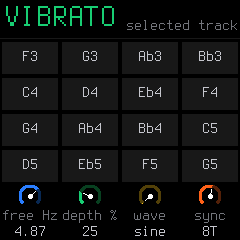
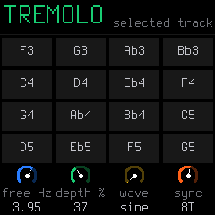

# Scale-aware grids and MIDI keyboard following — Merthsoft.13

The 16 grid tiles represent physical white keys, not an independent MIDI pad bank.
SEL, vibrato and tremolo labels now use mapped pitches from the common keyboard
mapping function. SEL chord labels retain chord quality and scale-aware root spelling.
SEL still selects literal song roots while held, so a second-line root hint explicitly
shows that action. LFO/ENV retain playable keys and unchanged keyboard LED behavior.

Seven-note scales spell pitches by diatonic letter degree; other scales and outside
notes choose enharmonics using the key. C minor shows Eb, Ab, Bb. F# major shows
E#. Octave spelling handles B#/Cb boundaries. With KEYS OFF, outside-scale notes
still show their actual chromatic pitch. WHITE walks scale degrees; SNAP rounds down.
No mapping is enabled merely by changing display labels.

HOME menu SYSTEM knob 2 exposes MIDI SCALE: OFF (default), KEYBOARD. Preference bit
23 in the existing persisted settings word defaults off for older settings. No project,
parameter, protocol or settings structure changes are required. KEYBOARD shares the
physical keyboard's scale pitch mapping over MIDI notes 0–127, with receiving track
KEYS/root/scale, device octave and track transpose. Drums and GM sampler kits bypass it.
It maps single pitches, not chord voicings or black-key chord modifiers. Keep OFF for
phone/sequencer output already expressing intended pitches.

A bounded 64-entry owner table records USB/TRS source, channel, input note, output
pitch and destination. Note-offs use this stored pitch even after root/scale/octave,
track or preference changes. Silent WHITE black keys are tracked too. Repeated
note-ons replace their previous owner; pitches shared by several MIDI owners remain
held until the last release. Overflow rejects a new note without evicting old owners;
unmatched note-offs cannot release another mapped pitch. Track panic clears that
track's owners. USB reset/detach releases USB owners without cutting matching TRS
owners. TRS unplug is not detectable. Existing keyboard/sequencer note ownership
and latch semantics remain unchanged.

`tests/scale_midi_grid_test.c` covers all roots/scales/keyboard modes and MIDI bounds,
accidental spelling, mode/scale/octave changes while held, SNAP collisions, USB/TRS
ownership, selected-track routing, panic, capacity rejection and persisted setting.
It also renders current grids for visual review. The broad UI/audio regression checks
SYSTEM knob controls and fuzzes 20,000 frames. No new physical or ISR deadline
measurement is claimed.

## Current firmware screens

Fresh production-code host framebuffer renders; not photographs of physical hardware.
