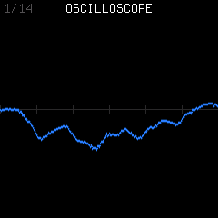
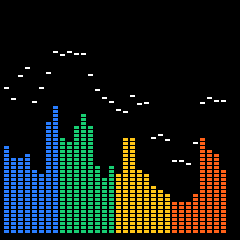
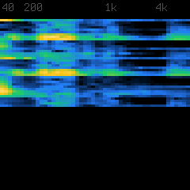
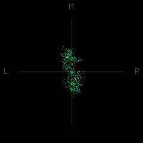
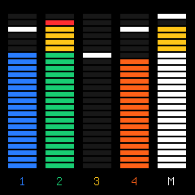
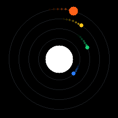
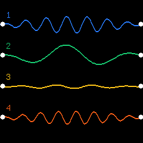

# FM1 visualizers

Merthsoft retains eight upstream styles and adds six: Polyrhythm, Note Trails,
Groove, Stereo Field, Song Journey and Beat Terrain. Fourteen are available.

On TRACKS, tap HOME to open, turn SELECT to cycle in either direction, and tap
HOME or a page button to close. The name appears briefly after selection. Keys,
PLAY and REC still work; holding a control layer temporarily shows its controls
and returns to the visualizer when released. Knobs 1–4 do not edit the hidden
TRACKS page; hold GLO and turn SELECT for tempo.

The selected style persists with device settings, deferred until stopped. Legacy
unavailable style IDs fall back to Oscilloscope; current style IDs remain stable.

## Added styles

| Style | Fresh framebuffer capture | What it shows |
| --- | --- | --- |
| Polyrhythm |  | Each track's pattern length, active steps and independent playhead. |
| Note Trails |  | Scrolling pitches across three synths, including chords/releases, and drum lanes below. |
| Groove |  | Eight steps per track with grid, swing, microtiming, hit levels and ratchets. |
| Stereo Field |  | Stereo cloud, left/right balance and width. |
| Song Journey |  | Song order or quick chain, current entry and remaining bars. This capture shows the READY state without an active arrangement. |
| Beat Terrain |  | Spectrum-driven wireframe hills moving at tempo. |

## Retained upstream styles

| Style | Fresh framebuffer capture | What it shows |
| --- | --- | --- |
| Oscilloscope |  | Mix waveform. |
| Spectrum |  | 32 frequency bands with falling caps. |
| Spectrogram |  | Scrolling frequency history. |
| Lissajous |  | Stereo relationship as a point cloud. |
| VU Meters |  | Four tracks and master with peak holds. |
| Circle |  | Waveform ring swelling with kick hits. |
| Orbit |  | Four planets on 1/2/4/8-beat periods around a mix-reactive sun. |
| Wires |  | One string per track, moving with its notes. |

## Rendering and verification

These are fresh 240×240 captures from the Merthsoft.8 production framebuffer
renderer driven by `tests/ui_pages_test.c`, October 9, 2026. The fixture plays a
four-track pattern with chords, drum hits, parameter locks and microtiming.
PNG conversion is lossless; these are host framebuffer captures, not camera photos.

The renderer reads existing waveform/peak/note/transport snapshots in the UI loop
every other frame. Its waveform view is before MASTER attenuation, so muting MASTER
does not freeze the picture. This describes scheduling, not a measured zero CPU cost.
Existing target ISR-budget limitations remain in the verification record.

The UI suite checks all 14 styles draw, selection wrapping, persistence and removed-ID
fallback, shared waveform/trail/Lissajous storage switching, MASTER-at-zero visualization,
hidden-knob isolation and layer/navigation behavior. Its 20,000-frame fuzz passes.

Lissajous history now shares the waveform/trail union, with its stereo snapshot in
the otherwise idle FFT scratch arrays. Mode entry clears shared history; subsequent
frames retain it. This saves 1,536 static RAM bytes with no pool growth. All fourteen
reference captures remain byte-identical; see [optimization evidence](OPTIMIZATION.md).
